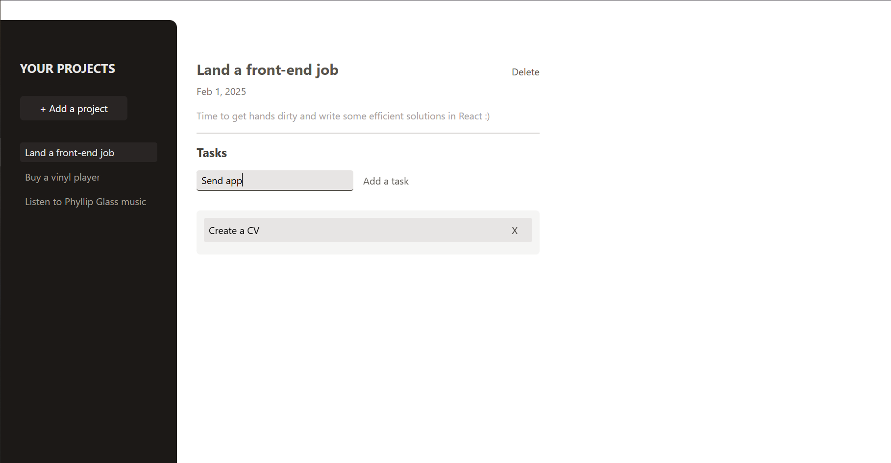

# Project management app

Fancy todo list where you can create projects with multiple tasks!

## Game UI



## How to run the project locally

### 0. Prerequisities:

- If you don't have `Node.js` on your PC, install it [here](https://nodejs.org/en/download) (use version **20.18.0** or above)

- Verify `node` version

```bash
node -v // Should print "v20.18.0" or above.
```

- Verify `npm` version

```bash
npm -v // Should print "10.9.0" or above.
```

### 1. Clone the repository:

```bash
git clone https://github.com/PikuzaMarie/project-management.git
```

### 2. Go to the directory:

```bash
cd project-management
```

### 3. Install dependencies:

```bash
npm install
```

### 4. Start the project

It will automatically run in your default browser at http://localhost:3000/

```bash
npm run dev
```

## Features

- [x] Create, view, delete projects & tasks for the project
- [x] `Validate input data`; if it's invalid, show modal with info message
- [x] Display `fallback content` if no project is selected if there are no tasks for the project yet
- [x] Used `refs` to get data from inputs
- [x] Used `forwardRef`, `useImperativeHandle` to create a modal window and call it on other components
- [x] Used `createPortal` to move the modal window higher in the DOM tree for `better accessibility and semantics`

## Extra

- [x] Used `Context API` together with `useReducer()` for state management - logic could be found in [store](./src/store/) folder
- [x] `Date formatting` using `local` settings
- [x] Clean code with the use of `ESLint`, `Prettier` & `lint-staged`
- [x] Deploy on Netlify so you can [manage your business plans](https://project-management-by-marie.netlify.app/)

## Contribution

This project was developed using materials from the`'React - The Complete Guide 2025'` instructed by `Maximilian Schwarzmüller` at `Academind`: [link to github repo](https://github.com/academind/react-complete-guide-course-resources/tree/main/attachments/09%20Practice%20Project%20-%20Project%20Management)
